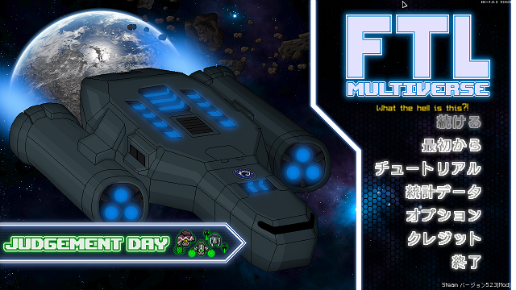
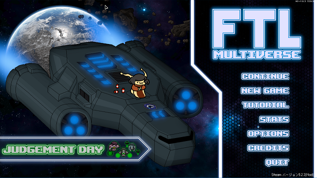

# FTL MOD「Multiverse」の日本語パッチ(機械翻訳:ちょっと手作業で翻訳)
FTL: Faster Than Light の overhaul mod である [Multiverse 5.2.3](https://subsetgames.com/forum/viewtopic.php?f=11&t=35332) への日本語パッチ(機械翻訳)です。 英語だとしんどくて機械翻訳で雰囲気だけでも・・と思って作りました。

ただ、遊んでいて意味が通じなさ過ぎて気になった部分や、多分ヒロイン（？）のビームマスター・リア関連など、その他いくつかの部分は手作業で翻訳しました。

## インストールに必要なもの
* FTL: Faster Than Light 本体
* [Slipstream Mod Manager](https://subsetgames.com/forum/viewtopic.php?f=12&t=17102)
   (動作には Java (JRE) が必要。Windows なら [こちら](https://www.java.com/ja/download/ie_manual.jsp) ）
* [Hyperspace 1.0.3](https://subsetgames.com/forum/viewtopic.php?f=11&t=35095)
* [Multiverse 5.2.3](https://subsetgames.com/forum/viewtopic.php?f=11&t=35332)
* [FTL: Hyperspace 日本語化MOD](https://seesaawiki.jp/ftl/d/MOD#content_3_6_1)
* [本パッチ](https://github.com/AyKo/ftl-multiverse-japanese-patch/raw/main/FTL-Multiverse_5.2.3_hotfix.jp-patch.zip)

## インストール
当方の環境がWindows/Steamですので、その環境を前提に書いています。違う環境の場合は異なる部分があると思いますが、適時置き換えて読んでください。

#### 1. FTLのインストール

#### 2. Slipstream Mod Manager の入手
[Slipstream Mod Manager](https://subsetgames.com/forum/viewtopic.php?f=12&t=17102) をダウンロードしてください。
ページを少し進めると Download と書いてある部分がありますのでダウンロードします。

解凍すると展開される modman.exe を実行すると起動できます（まだ起動しなくていいです）が、 Java で作成されているので、別途インストールも必要です。インストールされていない場合は、こちらを先にすましておく必要があります。([Windows版Javaのダウンロード](https://www.java.com/ja/download/ie_manual.jsp))

#### 3. Hyperspace の入手
[Hyperspace 1.0.3](https://subsetgames.com/forum/viewtopic.php?f=11&t=35095) をダウンロードしてください。
ページを少し進めると Download と書かれている部分がありますのでダウンロードします。

#### 4. Hyperspace の導入
前の項でダウンロードした FTL Hyperspace (1.0.3).zip を解凍します。解凍後、「Windows - Extract these files into where FTLGame.exe is」という名前のフォルダがありますので、その中のファイルをすべてFTLのインストールフォルダにコピーします。
私の場合、インストールファルダは C:\Steam\steamapps\common\FTL Faster Than Light でした。

コピー後、FTLのインストールフォルダで「downgrade.bat」を実行します。
実行すると「FTLGame.exe」が古いバージョンに置き換わります。元のファイルは「FTLGame_orig.exe」として、一応残されています。

#### 5. Multiverse の入手と格納
[Multiverse 5.2.3](https://subsetgames.com/forum/viewtopic.php?f=11&t=35332) をダウンロードしてください。

だいたい1/3くらいの場所に、DOWNLOAD MULTIVERSE BUILD - 5.2.3 HOTFIX と書かれている部分がありますので、その Google Drive と書かれたリンクの先にあります。
FTL-Multiverse 5.2.3 hotfix.zip というファイルをダウンロードできますので、これを zip のまま Slipstream Mod Manager の mod フォルダに保存して下さい。

#### 6. FTL: Hyperspace 日本語化MOD の入手と格納
[FTL: Hyperspace 日本語化MOD](https://seesaawiki.jp/ftl/d/MOD#content_3_6_1)にいって、[Hyperspace-ja.ftl](https://drive.google.com/file/d/1VwBDaD3ztAgD4GGdXm_WdSwuyE-FDwoh/view?usp=sharing) と [JapaneseFonts.ftl](https://drive.google.com/file/d/18EZMhs6Z9iKncLx0kfaliAxHrrK_G6qK/view?usp=sharing) をダウンロードしてください。

それぞれ、右上の  でダウンロードできます。

ダウンロードした２つのファイルを、Slipstream Mod Manager の mod フォルダに保存して下さい。

### 7. 日本語パッチ（機械翻訳:ちょっと手作業で翻訳）の入手と格納
本ページから [日本語パッチ(機械翻訳:ちょっと手作業で翻訳)](https://github.com/AyKo/ftl-multiverse-japanese-patch/raw/main/FTL-Multiverse_5.2.3_hotfix.jp-patch.zip) をダウンロードします。
これを zip のまま Slipstream Mod Manager の mod フォルダに保存して下さい。

### 8. パッチの適用
Slipstream Mod Manager を起動し、必要な初期設定をおこなったら、「ファイル」メニュー→「Preferences...」をクリックして設定画面を開いてください。開いたウィンドウの一番上のチェックボックス「allow_zip」にチェックをいれて、「Apply」ボタンを押してください。
次に「ファイル」メニュー→「Re-scan mods」をクリックしてください。FTL-Multiverse 5.2.3. hotfix.zip が選択できるようになります。

ここで、適用したいModをチェックをして「Patch」ボタンをクリックすると適用されますが、**順番が大事**です。チェックしたModを上から適用しますが、順序が正しくないと上手くいきません。
入れ替えたい項目をドラッグすることで移動できますので、以下にしたがって並べ替えとチェックをしてください。

順番は：
1. [FTL-Multiverse 5.2.3 hotfix]
2. [Hyperspace-ja]
3. [FTL-Multiverse_5.2.3_hotfix.jp-patch]
4. [JapaneseFonts]

必要な項目にチェックをしたら Patch ボタンをクリックします。クリックするとパッチの適用が始まります。うまくいくと、今すぐ起動するか？的な問い合わせが表示されます。ここまでくればOKです。

..と言いたいところですが、環境によっては上手く起動しないみたいです。
私の環境のようにメモリが 4GByte してない場合は、そのままだと上手くいかないことがあるらしいです。

私の場合 -opengl オプションをつけて直接起動するとできました。
私の環境の場合、Win+Rを押下後、

    "C:\Steam\steamapps\common\FTL Faster Than Light\FTLGame.exe" -opengl

と入力すると起動できました。

### 9. マルチバース起動！

よく条件は分からないのですが、タイトルが変わることもあるみたいです。
1回だけですが↓が表示されました。Slugかな..かわいい..。

(※まだHyperspace-jaを入れないときの画像です)
