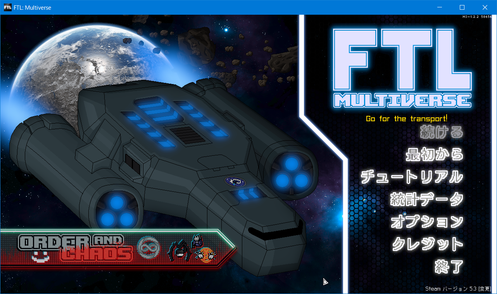

# FTL MOD「Multiverse」の日本語パッチ(機械翻訳:一部分は手作業翻訳)
FTL: Faster Than Light の overhaul mod である [Multiverse 5.4.1](https://subsetgames.com/forum/viewtopic.php?t=35332) への日本語パッチ(機械翻訳)です。 英語だとしんどくて機械翻訳で雰囲気だけでも・・と思って作りました。

ただ、遊んでいて意味が通じなさ過ぎて気になった部分や、真のエンディングまでのイベントを中心に、その他いくつかのイベント、多分ヒロイン（？）のビームマスター・リア関連など、その他もろもろの部分は手作業で翻訳しました。２万以上のテキストがあって、完全手作業はちょっと難しい..。

---

## FTL: Multiverse について
FTL: Multiverseは、FTL: Faster Than Lightの大規模なオーバーホールMODで、非公式ながらFTLの続編となります。

膨大な量の新しいイベントに加えて、**マルチエンディング**となっており、単純な勝利だけでなく真のエンディングなど複数の終結を見ることもできます。

システム的な部分にも手が加えてあり、50を超えるクルーの種類、200近くの新しい操作可能な船、500を超える新しい敵船、200を超える新しい武器とドローン、30を超える新しいセクターが追加されています。

## ストーリー

かつて、銀河連邦は反乱軍との戦争で壊滅の危機にあった。
しかし、たった一機の宇宙船が反乱軍の旗艦を撃破し、連邦に勝利をもたらした。
この伝説的な戦いから数十年経った。

連邦は、今やユニバース0と呼ばれているこの銀河の統治を取り戻せるかと思えたが、反乱軍の提督であるバンスはまだ死んでいなかった。
バンスとその部下たちは、厳重に封印された古代遺跡よりマルチバース・ドライブを回収し、別次元であるユニバース1に逃げ込んだのだった。
ユニバース1を拠点に、バンスは新たに軍を再編しユニバース0への反撃を開始した。
戦争は泥沼になりつつある。情報は少ないが、反乱軍は、連邦と非人類種の抹殺を目的としているようだ。

そこで君たちの出番となる。
再び、反乱軍の旗艦を撃破せよ。

## 攻略
[英語Wiki](https://ftlmultiverse.fandom.com/) を見るしかなさそうです。  
Google翻訳などでサイトを丸ごと翻訳しても、まあ何となく分かると思います。

攻略にはなっていませんが、紹介程度として[日本語Wiki](https://seesaawiki.jp/ftl-multiverse/)も書きました。

---

## インストール
当方の環境がWindows/Steamですので、その環境を前提に書いています。違う環境の場合は異なる部分があると思いますが、適時置き換えて読んでください。
また、Multiverse 5.3からインストーラー付きと、マニュアルインストール用のファイルがあります。

以下は、マニュアルインストール用の手順です。

インストーラ付きの場合は、いくつかの手順が違います。Mod Managerなどのインストールなどもおこなってくれますが、まっさらに状態で(Pure Vanilla)やってくださいね、とのことです。
その場合、FTLのインストール先にMod Manager本体とmodフォルダがありますので、そのmodフォルダに対して日本語パッチを入れて適用してください。

### インストールに必要なもの
* FTL: Faster Than Light 本体
* [Slipstream Mod Manager](https://subsetgames.com/forum/viewtopic.php?f=12&t=17102)
   (動作には Java (JRE) が必要。Windows なら [こちら](https://www.java.com/ja/download/ie_manual.jsp) ）
* [Hyperspace 1.9.0](https://subsetgames.com/forum/viewtopic.php?f=11&t=35095)
* [Multiverse 5.4.1](https://subsetgames.com/forum/viewtopic.php?t=35332)
* [FTL: Hyperspace 日本語化MOD](https://seesaawiki.jp/ftl/d/MOD#content_3_6_1)
* [本パッチ](https://github.com/AyKo/ftl-multiverse-japanese-patch/raw/main/FTL-Multiverse_5.4.1.jp-patch.zip)

#### 1. FTLのインストール
Steamなど。

#### 2. Slipstream Mod Manager の入手
[Slipstream Mod Manager](https://subsetgames.com/forum/viewtopic.php?f=12&t=17102) をダウンロードしてください。
ページを少し進めると Download と書いてある部分がありますのでダウンロードします。

解凍すると展開される modman.exe を実行すると起動できます（まだ起動しなくていいです）が、 Java で作成されているので、別途インストールも必要です。インストールされていない場合は、こちらを先にすましておく必要があります。([Windows版Javaのダウンロード](https://www.java.com/ja/download/ie_manual.jsp))

#### 3. Hyperspace の入手
[Hyperspace 1.9.0](https://subsetgames.com/forum/viewtopic.php?f=11&t=35095) をダウンロードしてください。
ページを少し進めると Download と書かれている部分がありますのでダウンロードします。

#### 4. Hyperspace の導入（FTLのバージョンダウン＋バイナリパッチ）
前の項でダウンロードした FTL Hyperspace (1.9.0).zip を解凍します。解凍後、「Windows - Extract these files into where FTLGame.exe is」という名前のフォルダがありますので、その中のファイルをすべてFTLのインストールフォルダにコピーします。
私の場合、インストールファルダは C:\Steam\steamapps\common\FTL Faster Than Light でした。

コピー後、FTLのインストールフォルダで「downgrade.bat」を実行します。
FTL自体のバージョンダウンが必要で、これを実行すると「FTLGame.exe」が古いバージョンに置き換わります。元のファイルは「FTLGame_orig.exe」として、一応残されています。

なお、Multiverse自体に Hyperspace.ftl が含まれているらしいので、こちらはいりません。

#### 5. Multiverse の入手と格納
[Multiverse 5.4.1](https://subsetgames.com/forum/viewtopic.php?t=35332) をダウンロードしてください。

だいたい1/3くらいの場所に、DOWNLOAD RAW FILES (OTHER PLATFORMS, UPDATES, MANUAL INSTALL) MULTIVERSE VERSION 5.4.1 - ORCHIDS REVAMPED と書かれている部分がありますので、その Google Drive と書かれたリンクの先にあります。
Asset File と Data File の２つをダウンロードしてください。
以下の2つのファイルとなります：
- Multiverse 5.4 - Assets (Patch above Data).zip
- Multiverse 5.4.1 - Data.zip

ダウンロードした２つのファイルを、Slipstream Mod Manager の mod フォルダに保存して下さい。

#### 6. FTL: Hyperspace 日本語化MOD の入手と格納
[FTL: Hyperspace 日本語化MOD](https://seesaawiki.jp/ftl/d/MOD#content_3_6_1)にいって、[Hyperspace-ja.ftl](https://drive.google.com/file/d/1VwBDaD3ztAgD4GGdXm_WdSwuyE-FDwoh/view?usp=sharing) と [JapaneseFonts.ftl](https://drive.google.com/file/d/18EZMhs6Z9iKncLx0kfaliAxHrrK_G6qK/view?usp=sharing) をダウンロードしてください。

それぞれ、右上の  でダウンロードできます。

ダウンロードした２つのファイルを、Slipstream Mod Manager の mod フォルダに保存して下さい。

#### 7. 日本語パッチの入手と格納
本ページから [本パッチ](https://github.com/AyKo/ftl-multiverse-japanese-patch/raw/main/FTL-Multiverse_5.4.1.jp-patch.zip) をダウンロードします。

ダウンロードしたファイルを、Slipstream Mod Manager の mod フォルダに保存して下さい。

#### 8. パッチの適用
Slipstream Mod Manager を起動し、必要な初期設定をおこなったら、「ファイル」メニュー→「Preferences...」をクリックして設定画面を開いてください。開いたウィンドウの一番上のチェックボックス「allow_zip」にチェックをいれて、「Apply」ボタンを押してください。
次に「ファイル」メニュー→「Re-scan mods」をクリックしてください。TL-Multiverse_5.4.1.jp-patch.zip が選択できるようになります。

ここで、適用したいModをチェックをして「Patch」ボタンをクリックすると適用されますが、**順番が大事**です。チェックしたModを上から適用しますが、順序が正しくないと上手くいきません。
入れ替えたい項目をドラッグすることで移動できますので、以下にしたがって並べ替えとチェックをしてください。

順番は：
1. [FTL-Multiverse 5.4 - Assets (Patch above Data)]
2. [FTL-Multiverse 5.4.1 - Data]
3. [Hyperspace-ja]
4. [JapaneseFonts]
5. [FTL-Multiverse_5.4.1.jp-patch]

必要な項目にチェックをしたら Patch ボタンをクリックします。クリックするとパッチの適用が始まります。うまくいくと、今すぐ起動するか？的な問い合わせが表示されます。ここまでくればOKです。

#### 9. マルチバース起動！

#### 10. 起動しない場合
環境によっては上手く起動しないみたいです。
たとえば私の環境のようにメモリが 4GByte してない場合は、そのままだと上手くいかないことがあるらしいです。
ダメな場合、ロード中の途中から先に進みませんでした。

私の場合 -opengl オプションをつけて直接起動するとできました。
Win+Rを押下後、

    "C:\Steam\steamapps\common\FTL Faster Than Light\FTLGame.exe" -opengl

と入力すると起動できました。
それ以外が原因の場合は、

    "C:\Steam\steamapps\common\FTL Faster Than Light\FTLGame.exe" -diretx

でいける場合もあるみたいです。

